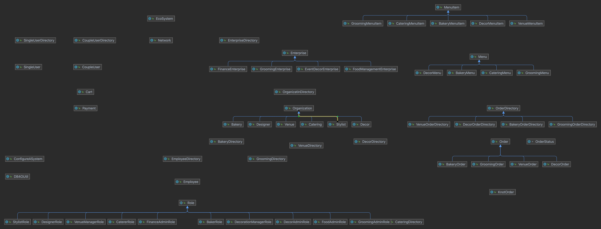

# THE KNOT

## Problem Statement:

The idea of having a grand wedding where theoretically the bride lays out all the plans, but during, the actual planning everything seems to go wrong. To manage responsibilities at every stage of a planned wedding, an event management business typically employs a wide range of softwares. there is a lack of connection across the aforementioned platforms, which necessitates countless hours of labor to manually ingest data between apps. Additionally, paying individually to all these apps increases the variables which regulates the revenues of the company.

Just like any other major milestone in our lives, a wedding day is always stressful. From fitting the dress, applying makeup, and finally arriving at the venue in time. The couples have to worry about too many things that make it impossible for them to keep track of time or any other event except for the roles they play. When you hire a single planner, we worry about all the things that might go wrong and let the couple concentrate on the parts they have to play on the wedding day. All we need is the guide on what the couple wants and we deal with the vendors and suppliers to ensure that the cake is delivered on time, flowers are delivered as ordered, and that the food and drinks are in plenty for the guests.

The match making feature is to provide Grooms and Brides with excellent matchmaking experience by exploring the opportunities and resources to meet true potential partner. It will provide platform to a lot of Bride/Groom for finding perfect match. The Bride/Groom can get their interest for finding their partner. Bride/Groom can directly search partner according to their required criteria.

The KNOT aims to tackle these problem by integrating all the different modules in every phase of a Grand Wedding into a single application to cut down on the unnecessary amounts of time and money spend on these different apps.

## UML Diagram

</img>
